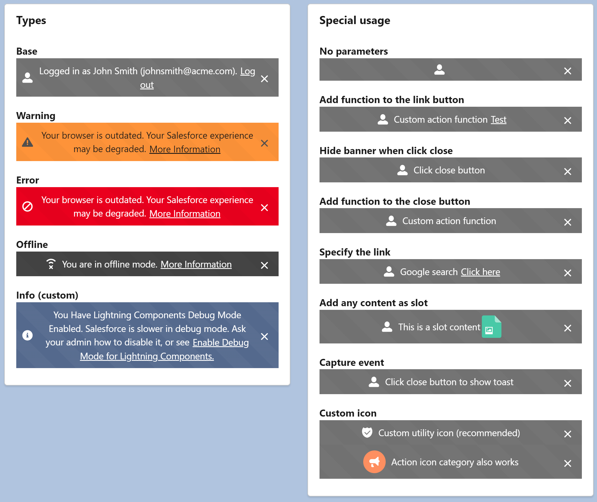

# LWC Alert Banner (ALPHA)



## About

SLDS Alert Banner Generic Component Developed because Salesforce doesn't provide a standard component.

## Features
- Native SLDS Style: https://www.lightningdesignsystem.com/components/alert/
- Support all the SLDS variants
- Integrated on a single component (easy to copy to multiple projects)
- Supports function execution when clicking on a button
- Hide banner when click close
- New custom type (info) based on salesforce UI
- Slot support


## Instructions

### Use on your project
Everything was developed in a single LWC, so you just need a new single component on your project.

- Copy the following files to your project:
    - force-app/main/default/lwc/lwcAlertBanner/**
- Call the component and pass the options
```
<c-lwc-alert-banner type="base" message="Logged in as John Smith (johnsmith@acme.com)." link-message="Log out" link="#"></c-lwc-alert-banner>
```

### Testing and learn how to use it

- Run the `createorg.sh` to create a scratch org
- Open the `LWC Alert Banner` lightning app
- Explore the code on the `samples` component
- Edit the page to preview on mobile devices or login with your mobile device (check the `password.env` file)


## References

https://www.lightningdesignsystem.com/components/alert/

